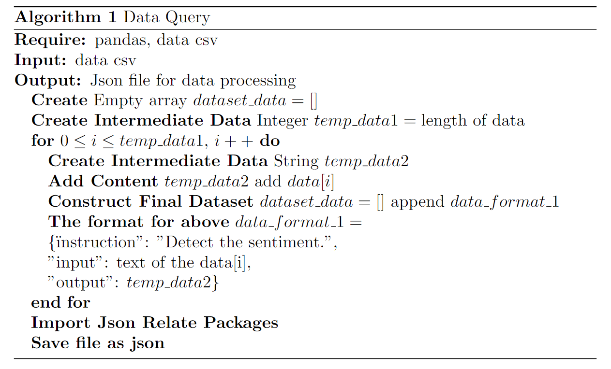
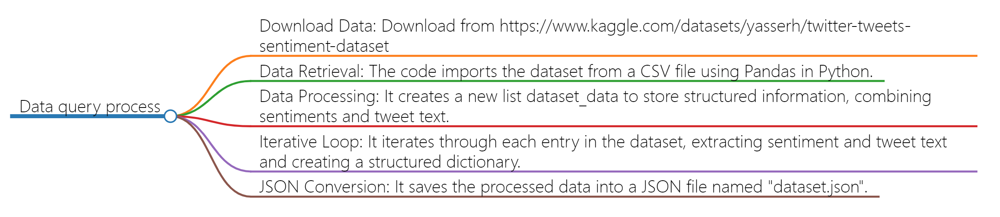

# Code
## Description
- The data query process involves importing a dataset using Pandas in Python, reading a CSV file, and creating a JSON file. The code initializes an empty list for data storage, iterates through each row of the dataset, and constructs a structured output based on specific columns. This structured data is formatted into a dictionary and appended to the list. Finally, the list containing the structured data is written to a JSON file using the json.dump method. This process is language-agnostic and showcases the general steps of reading, processing, and exporting data, adaptable to languages like Java and Go with their respective syntax adjustments.
## pseudo-code
- 
```
\begin{algorithm}
    \caption{Data Query}
  \begin{algorithmic}
    \REQUIRE pandas, data csv
    \INPUT data csv
    \OUTPUT Json file for data processing
    \STATE \textbf{Create} Empty array $dataset\_data=[]$
    \STATE \textbf{Create Intermediate Data} Integer 
 $temp\_data1=\text{length of data}$
    \FOR{$0 \leq i\leq temp\_data1$, $i++$}
      \STATE \textbf{Create Intermediate Data} String $temp\_data2$
      \STATE \textbf{Add Content} $temp\_data2$ add $data[i]$
      \STATE \textbf{Construct Final Dataset} $dataset\_data=[]$ append $data\_format\_1$
      \STATE \textbf{The format for above} $data\_format\_1=$
        \STATE\{\"instruction": "Detect the sentiment.",
        \STATE"input": text of the data[i],
        \STATE"output": $temp\_data2$\}
        \ENDFOR
        \STATE \textbf{Import Json Relate Packages}
        \STATE \textbf{Save file as json}
  \end{algorithmic}
\end{algorithm}
```
## Flowchart
- 