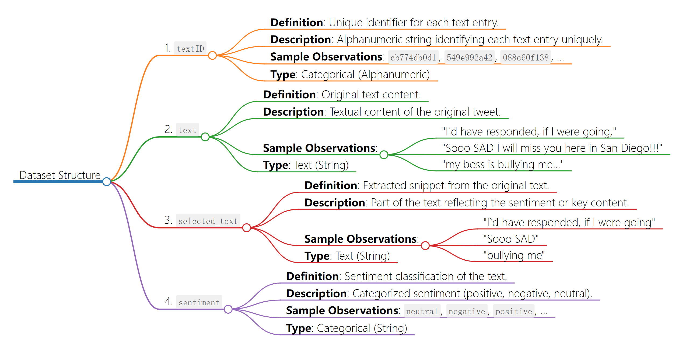

# Data
## Description
- The dataset contains several columns: 'textID' identifying each entry, 'text' representing the original text, 'selected_text' indicating a selected part of the original text, and 'sentiment' classifying the sentiment as positive, negative, or neutral. The 'text' column contains various tweets, while 'selected_text' represents a snippet of the original text that carries the sentiment. Sentiments are diverse, ranging from positive (like "fun" and "interesting"), neutral (like URLs or general statements), to negative (such as "bullying" or expressions of sadness and frustration). The dataset seems derived from social media or text-based platforms, with sentiments extracted to train sentiment analysis or similar models. The 'selected_text' could be the focal point for sentiment analysis algorithms, teaching them to identify sentiment-bearing phrases within larger texts.
## Data Dictionary
|  **Variable** 	|             **Definition**            	|                          **Description**                          	|   **Type**  	|                                                  **Sample Observations**                                                 	|
|:-------------:	|:-------------------------------------:	|:-----------------------------------------------------------------:	|:-----------:	|:------------------------------------------------------------------------------------------------------------------------:	|
|     textID    	| Unique identifier for each text entry 	|          Alphanumeric string identifying each text entry          	| Categorical 	|                                            cb774db0d1, 549e992a42, 088c60f138,                                           	|
|      text     	|             Original text             	|               Textual content of the original tweet               	|     Text    	| "I`d have responded, if I were going," "Sooo SAD I will miss you here in San Diego!!!", "my boss is bullying me...", ... 	|
| selected_text 	|   Selected part of the original text  	| Extracted snippet of text reflecting the sentiment or key content 	|     Text    	|                           "I`d have responded, if I were going", "Sooo SAD", "bullying me", ...                          	|
|   sentiment   	|         Sentiment of the text         	|  Categorized sentiment of the text (positive, negative, neutral)  	| Categorical 	|                                                neutral, negative, positive                                               	|
### Frequency/Ranges/Units:

- textID: Unique alphanumeric strings.
- text and selected_text: Variable-length textual data.
- sentiment: Categorical variable with three categories (positive, negative, neutral).
### Type:
- textID: Categorical (Alphanumeric)
- text and selected_text: Text (String)
- sentiment: Categorical (String)
### Sample Observations:
- textID: cb774db0d1, 549e992a42, 088c60f138, ...
- text: "I`d have responded, if I were going," "Sooo SAD I will miss you here in San Diego!!!", "my boss is bullying me...", ...
- selected_text: "I`d have responded, if I were going", "Sooo SAD", "bullying me", ...
- sentiment: neutral, negative, positive, ...
## Flowchart

