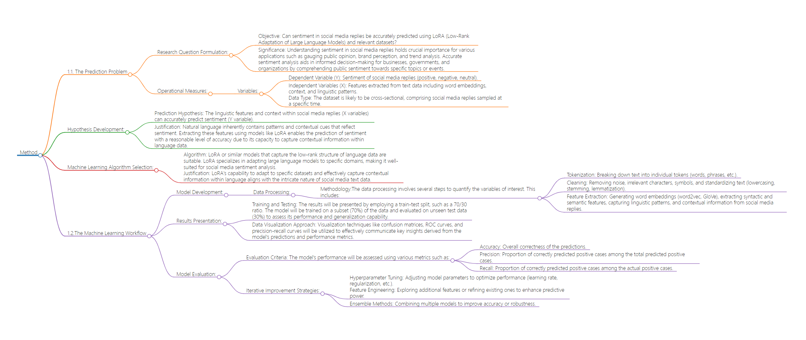

# Method
## 1.1. The Prediction Problem
### Research Question Formulation:

- Objective: Can sentiment in social media replies be accurately predicted using LoRA (Low-Rank Adaptation of Large Language Models) and relevant datasets?
- Significance: Understanding sentiment in social media replies holds crucial importance for various applications such as gauging public opinion, brand perception, and trend analysis. Accurate sentiment analysis aids in informed decision-making for businesses, governments, and organizations by comprehending public sentiment towards specific topics or events.
### Operational Measures:

#### Variables:
- Dependent Variable (Y): Sentiment of social media replies (positive, negative, neutral).
- Independent Variables (X): Features extracted from text data including word embeddings, context, and linguistic patterns.
Data Type: The dataset is likely to be cross-sectional, comprising social media replies sampled at a specific time.
## Hypothesis Development:

- Prediction Hypothesis: The linguistic features and context within social media replies (X variables) can accurately predict sentiment (Y variable).
- Justification: Natural language inherently contains patterns and contextual cues that reflect sentiment. Extracting these features using models like LoRA enables the prediction of sentiment with a reasonable level of accuracy due to its capacity to capture contextual information within language data.
## Machine Learning Algorithm Selection:
- Algorithm: LoRA or similar models that capture the low-rank structure of language data are suitable. LoRA specializes in adapting large language models to specific domains, making it well-suited for social media sentiment analysis.
Justification: LoRA's capability to adapt to specific datasets and effectively capture contextual information within language aligns with the intricate nature of social media text data.
## 1.2.The Machine Learning Workflow
### Model Development:
#### Data Processing: 
##### Methodology:The data processing involves several steps to quantify the variables of interest. This includes:
- Tokenization: Breaking down text into individual tokens (words, phrases, etc.).
- Cleaning: Removing noise, irrelevant characters, symbols, and standardizing text (lowercasing, stemming, lemmatization).
- Feature Extraction: Generating word embeddings (word2vec, GloVe), extracting syntactic and semantic features, capturing linguistic patterns, and contextual information from social media replies.
### Results Presentation:
- Training and Testing: The results will be presented by employing a train-test split, such as a 70/30 ratio. The model will be trained on a subset (70%) of the data and evaluated on unseen test data (30%) to assess its performance and generalization capability.
- Data Visualization Approach: Visualization techniques like confusion matrices, ROC curves, and precision-recall curves will be utilized to effectively communicate key insights derived from the model's predictions and performance metrics.
### Model Evaluation:
#### Evaluation Criteria: The model's performance will be assessed using various metrics such as:
- Accuracy: Overall correctness of the predictions.
- Precision: Proportion of correctly predicted positive cases among the total predicted positive cases.
- Recall: Proportion of correctly predicted positive cases among the actual positive cases.
#### Iterative Improvement Strategies:
- Hyperparameter Tuning: Adjusting model parameters to optimize performance (learning rate, regularization, etc.).
Feature Engineering: Exploring additional features or refining existing ones to enhance predictive power.
- Ensemble Methods: Combining multiple models to improve accuracy or robustness.

## Flowchart 

# Citations:
- Hu, Edward J., Yelong Shen, Phillip Wallis, Zeyuan Allen-Zhu, Yuanzhi Li, Shean Wang, Lu Wang, and Weizhu Chen. 2021. “LoRA: Low-Rank Adaptation of Large Language Models.” ArXiv:2106.09685 [Cs], October. https://arxiv.org/abs/2106.09685.
```
@article{hu2021lora,
  title={Lora: Low-rank adaptation of large language models},
  author={Hu, Edward J and Shen, Yelong and Wallis, Phillip and Allen-Zhu, Zeyuan and Li, Yuanzhi and Wang, Shean and Wang, Lu and Chen, Weizhu},
  journal={arXiv preprint arXiv:2106.09685},
  year={2021}
}```


